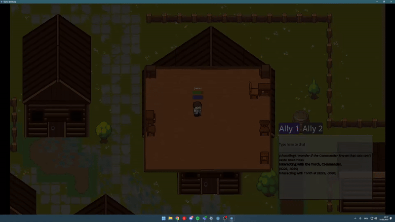

# 2D Game Development Project

## Project Overview

This project is a 2D game developed as part of the Games and Visual Effects course during the winter term of 2023/2025.

---

The game is a puzzle game with an integrated AI that you can chat with through your allies. It can also control the allies and interact with objects.    
Currently it's just a small demo with only one level but you can try it out yourself, we're sure that it'll be a lot of fun.   
You spawn with two allies which you can talk to, use commands like "go to" and "interact" and which are your eyes (they can spot objects, places and tell you important information about them).


You can switch in between them with the buttons or with the right mouse button. You are also able to control them by clicking with the left mouse button on the map.

You can open the inventory after removing focus from the chat windows with "Escape" through pressing "E"



---

## Setting Up for Development

To get started with the game development, follow these steps:

1. **Download Godot (Mono Version)**:  
   [Godot Download](https://godotengine.org/download)  
   *Ensure you download the Mono version for C# support.*

2. **Install .NET 8**:  
   [.NET 8 Download](https://dotnet.microsoft.com/en-us/download)

3. **Install Git**:  
   [Git Download](https://git-scm.com/downloads)  
   *If you haven’t installed it yet, make sure to do so!*

4. **Set Up SSH Key**:  
   [Setup SSH](https://docs.github.com/en/authentication/connecting-to-github-with-ssh/checking-for-existing-ssh-keys)  
   *Ensure you have an SSH key for accessing the repository.*

5. **Install Git Large File Storage (LFS)**:  
   [Guide to Install Git LFS](https://github.com/git-lfs/git-lfs?utm_source=gitlfs_site&utm_medium=installation_link&utm_campaign=gitlfs#installing)

6. **Get a Gemini API key**:  
   [Get a key](https://ai.google.dev/gemini-api/docs/api-key)  
   After getting the key, make sure you save it somewhere, since it won't show up again.
   If you start the game without a key, it will prompt you to paste you key to the text field, after that it is safed and you shouldn't have to paste it again.

7. **Insert Gemini API key**:   
   After starting the game, enter the API key in one of the chat boxes of the allies, close the game and restart.  
---

## Useful Resources

- **Godot Documentation**:  
  [Godot Docs](https://docs.godotengine.org/en/stable/index.html)

- **C# Documentation**:  
  [C# Docs](https://learn.microsoft.com/dotnet/csharp/)

---

## GitHub LFS

### Why Use Git LFS?
Git LFS (Large File Storage) is essential for managing large files such as textures and audio assets. After installing Git LFS, you can continue using Git as usual.

### Adding New File Types to LFS
To track specific file types, use the following commands:

```bash
git lfs track "myfile.myending"
git lfs track "*.myending"
```

### Further Help
For additional assistance, you can use:
```bash
git lfs help <command>
git lfs <command> -h
```

---

## Guidelines

- **Branching**: 
  - You **cannot push** directly to the `main` branch. 
  - Create a **branch** and then submit a **Pull Request (PR)**.

- **Merging**:
  - You **cannot merge** into the `main` branch without a PR that has one or more reviews and where all checks have passed.

- **C#**
  - We decided to use C# exlusively in Godot, so you can't use gdscript.
  - [C# specific Godot Documentation](https://docs.godotengine.org/en/stable/tutorials/scripting/c_sharp/c_sharp_basics.html)

- **C# Formatting**:
  - We adhere to standard C# formatting guidelines. 
  - Format the project with:
    ```bash 
    dotnet format Game.sln
    ```
  - You may also configure your editor to format on save. Ensure that your code is properly formatted before making a PR, as unformatted code may cause tests to fail.

- **File Placement**:
  - `.tscn` (scene) files **must** be placed inside the `scenes` folder.
  - `.cs` (C# script) files **must** be placed inside the `scripts` folder.
  - Assets **must** be located within the `assets` folder.

---
